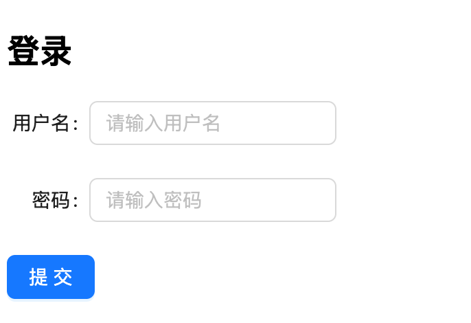

## Formily 简介

Formily 是一款专注于解决中台表单场景的 JavaScript 库，具备高性能、支持多种前端框架等优势，能够轻松应对复杂的表单业务需求。它将表单的逻辑和视图进行分离，使得表单开发更加高效和可维护。例如，在一个大型企业级应用中，涉及到各种复杂的表单交互，Formily 可以很好地处理这些场景，提升开发效率和用户体验。

## 使用场景

由于 formily 可以通过配置 json schema 渲染表单，因此可以很方便的复用表单内部逻辑，而适配不同端 UI 则交给 UI 层，下面是一些 formily 能力的基本使用

### 表单联动

在复杂表单中，表单联动是常见的需求。比如，当用户选择省份后，城市下拉框会自动更新为该省份对应的城市。以下是使用 Formily 实现表单联动的示例代码：

```js
import React, { useState } from "react";
import { createForm } from "@formily/core";
import { FormProvider, Field } from "@formily/react";
import { Select } from "antd";

const { Option } = Select;

// 模拟省份和城市数据
const provinceCityMap = {
  北京: ["东城区", "西城区", "朝阳区"],
  上海: ["黄浦区", "徐汇区", "长宁区"]
};

const form = createForm();
const provinces = Object.keys(provinceCityMap);
const ProvinceCityForm = () => {
  const [selectedProvince, setSelectedProvince] = useState("");

  const handleProvinceChange = (value) => {
    setSelectedProvince(value);
    form.setFieldValue("city", "");
  };

  return (
    <FormProvider form={form}>
      <Field name="province">
        <Select placeholder="请选择省份" onChange={handleProvinceChange}>
          {provinces.map((province) => (
            <Option key={province} value={province}>
              {province}
            </Option>
          ))}
        </Select>
      </Field>
      <Field name="city">
        <Select placeholder="请选择城市">
          {selectedProvince &&
            provinceCityMap[selectedProvince].map((city) => (
              <Option key={city} value={city}>
                {city}
              </Option>
            ))}
        </Select>
      </Field>
    </FormProvider>
  );
};
```

### 异步数据源

当表单中需要使用异步数据源时，Formily 可以通过`useAsync`等方法来处理数据加载和更新。例如，从后端获取用户列表并展示在下拉框中：

```js
import React from "react";
import { createForm } from "@formily/core";
import { FormProvider, Field } from "@formily/react";
import { Select } from "antd";
import axios from "axios";

const { Option } = Select;
const form = createForm();

const UserSelectForm = () => {
  const [users, setUsers] = React.useState([]);
  const [loading, setLoading] = React.useState(false);

  React.useEffect(() => {
    setLoading(true);
    axios
      .get("/api/users")
      .then((response) => {
        setUsers(response.data);
      })
      .catch((error) => {
        console.error("Error fetching users:", error);
      })
      .finally(() => {
        setLoading(false);
      });
  }, []);

  return (
    <FormProvider form={form}>
      <Field name="user">
        <Select placeholder="请选择用户" loading={loading}>
          {users.map((user) => (
            <Option key={user.id} value={user.id}>
              {user.name}
            </Option>
          ))}
        </Select>
      </Field>
    </FormProvider>
  );
};
```

### 表单场景化

以卡片式表单为例，Formily 可以轻松实现这种场景。假设我们有一个用户信息卡片式表单：

```js
import React from "react";
import { createForm } from "@formily/core";
import { FormProvider, Field } from "@formily/react";
import { Card, Input } from "antd";

const form = createForm();

const UserCardForm = () => {
  return (
    <FormProvider form={form}>
      <Card title="用户信息">
        <Field name="name">
          <Input placeholder="姓名" />
        </Field>
        <Field name="age">
          <Input placeholder="年龄" />
        </Field>
      </Card>
    </FormProvider>
  );
};

export default UserCardForm;
```

## JSON Schema 形式用法

### JSON Schema 规范

JSON Schema 是一种用于规范 JSON 文件内容的协议，Formily 遵循 draft - 07 标准。它通过定义数据的结构、类型、格式等，来确保数据的一致性和有效性。

### schema 字段描述

以下是一个简单的 schema 示例：

```js
export const schema = {
  type: "object",
  title: "用户信息",
  properties: {
    age: {
      type: "string", // // 定义数据类型，如`string`、`number`、`object`等。
      title: "年龄",
    }
    name: {
      type: "string", // // 定义数据类型，如`string`、`number`、`object`等。
      title: "姓名", // 用于描述字段的标题，通常在表单中显示为标签。
      required: true, // 指定字段是否为必填项。
      "x-component": "Input", // 表单项的组件
      // 表单项的组件 props
      "x-component-props": {
        // placeholder: "请"
      },
      // 表单项的装饰器
      "x-decorator": "FormItem",
      // schema 中主要的联动写法
      "x-reactions": [
        {
          dependencies: ["age"],
          fulfill: {
            // TODO schema 与 state 使用的场景的区别
            // schema: {
            //   "x-visible": "{{ $deps[0] === 'sex' }}" // 控制字段显示与隐藏
            // },
            state: {
              visible: "{{ $deps[0] >= 18 }}"
            },
            disabled: false, // 控制字段禁用与启用
            // 设置字段值,可以是具体的值，也可以是一个函数
            value: (val: any) => {
              return val;
            },
            validate: true, // 触发表单校验
            // 执行副作用函数，比如异步请求、日志记录等。
            sideEffects: () => {
              console.log("依赖字段 selectOptions 变更");
            },
            setProps: ""
          }
        },
        // 也可以直接写方法执行
        (field: Field) => {
          console.log("field", field);
          const age = field.query(".age").value();
          if (age >= 18) {
            // field.setComponentProps({});
            field.setValue("1");
          } else {
            field.setComponentProps({
              placeholder: '未满18岁'
            });
            // field.setValue(undefined);
          }
        }
      ]
    }
  }
};
```

其中 `x-component`、`x-component-props`、`x-decorator` 均为 UI 组件相关属性，可参考 antd 的实现
[@formily/antd-v5](https://antd5.formilyjs.org/zh-CN/components/form-item)

### 应用示例

结合上述 schema，使用 Formily 创建表单的示例代码如下：

```js
import React from "react";
import { createForm } from "@formily/core";
import { FormProvider, createSchemaField } from "@formily/react";
import { Input, NumberPicker } from "antd";
import { schema } from "./schema.js";

const form = createForm();
const SchemaField = createSchemaField({
  components: {
    Input
  }
});

const UserInfoSchemaForm = () => {
  return (
    <FormProvider form={form}>
      <SchemaField schema={schema} />
    </FormProvider>
  );
};
```

## 在 React 中的使用

### 准备工作

在 React 项目中使用 Formily，需要安装以下依赖包：

```
pnpm install @formily/core @formily/react @formily/antd-v5
```

### 基本使用

下面是一个简单的 React 表单示例，展示 Formily 的基本使用方法：

```js
import { createForm } from "@formily/core";
import { FormProvider } from "@formily/react";
import { FormItem, Input } from "@formily/antd-v5";
import { Button } from "antd";

// 创建表单实例
const form = createForm();
export default () => {
  return (
    <FormProvider form={form}>
      <FormItem label="用户名" labelCol={6} style={{ width: "240px" }}>
        <Input name="username" placeholder="请输入用户名" />
      </FormItem>
      <FormItem label="密码" labelCol={6} style={{ width: "240px" }}>
        <Input name="password" type="password" placeholder="请输入密码" />
      </FormItem>
      <Button type="primary" htmlType="submit">
        提交
      </Button>
    </FormProvider>
  );
};
```

<!--  -->

<div style="text-align:center">示例图</div>


### 深入使用

#### 自定义组件

假设我们有一个自定义的日期选择组件，如何在 Formily 中使用：

```js
import React from "react";
import { createForm } from "@formily/core";
import { FormProvider, Field } from "@formily/react";
import { DatePicker } from "antd";

const form = createForm();

const MyDatePicker = React.forwardRef((props, ref) => {
  return <DatePicker {...props} ref={ref} />;
});

const CustomComponentForm = () => {
  return (
    <FormProvider form={form}>
      <Field name="date" component={MyDatePicker}>
        <MyDatePicker placeholder="请选择日期" />
      </Field>
    </FormProvider>
  );
};

export default CustomComponentForm;
```

#### 表单校验

使用 Formily 进行表单校验，例如验证邮箱格式：

```js
import React from "react";
import { createForm } from "@formily/core";
import { FormProvider, Field } from "@formily/react";
import { Input, Button } from "antd";

const form = createForm();

const validateEmail = (value) => {
  const regex = /^[^\s@]+@[^\s@]+\.[^\s@]+$/;
  return regex.test(value);
};

const ValidationForm = () => {
  const handleSubmit = () => {
    form
      .validate()
      .then((values) => {
        console.log("表单提交数据:", values);
      })
      .catch((error) => {
        console.error("表单验证失败:", error);
      });
  };

  return (
    <FormProvider form={form}>
      <Field
        name="email"
        rules={[
          {
            validator: (_, value) => {
              if (!validateEmail(value)) {
                return Promise.reject(new Error("请输入正确的邮箱格式"));
              }
              return Promise.resolve();
            }
          }
        ]}
      >
        <Input placeholder="请输入邮箱" />
      </Field>
      <Button type="primary" onClick={handleSubmit}>
        提交
      </Button>
    </FormProvider>
  );
};

export default ValidationForm;
```

#### 表单状态管理

获取表单的状态，如是否有未保存的修改：

```js
import React from "react";
import { createForm } from "@formily/core";
import { FormProvider, useForm } from "@formily/react";
import { Input, Button } from "antd";

const form = createForm();

const StatusManagementForm = () => {
  const { form: formInstance } = useForm();
  const handleSubmit = () => {
    formInstance
      .validate()
      .then((values) => {
        console.log("表单提交数据:", values);
      })
      .catch((error) => {
        console.error("表单验证失败:", error);
      });
  };

  React.useEffect(() => {
    const unsubscribe = formInstance.subscribe((state) => {
      console.log("表单状态:", state);
      if (state.dirty) {
        console.log("表单有未保存的修改");
      }
    });
    return () => {
      unsubscribe();
    };
  }, []);

  return (
    <FormProvider form={form}>
      <Field name="name">
        <Input placeholder="请输入姓名" />
      </Field>
      <Button type="primary" onClick={handleSubmit}>
        提交
      </Button>
    </FormProvider>
  );
};

export default StatusManagementForm;
```

## reaction 源码解析

### 引入 reaction 的目的

在 Formily 的架构中，数据的响应式变化管理至关重要。reaction 机制的引入，旨在实现对数据状态变化的高效监听与响应，确保表单中各个组件能及时、准确地反映数据的更新，提升用户交互体验。例如，当表单中的某个字段值发生改变时，与之关联的其他字段或组件能够自动更新，这背后便是 reaction 在发挥作用。

### 关键代码逻辑

在 Formily 的源码中，reaction 相关代码主要集中在核心模块。其核心逻辑基于依赖收集与发布订阅模式。当数据状态发生变化时，会触发依赖收集过程中记录的所有相关回调函数。

```js
// 简化的 reaction 实现示例
function reaction(trackFn, effectFn) {
  let dep = new Set();
  let target = {};
  // 依赖收集
  let oldValue = track(target, trackFn);
  const cleanup = () => {
    dep.forEach((fn) => fn());
  };
  // 创建响应式副作用
  const runner = () => {
    let newValue = track(target, trackFn);
    if (newValue !== oldValue) {
      effectFn(newValue, oldValue, cleanup);
      oldValue = newValue;
    }
  };
  runner();
  return cleanup;
}

function track(target, fn) {
  let value;
  // 这里模拟触发 trackFn，在实际中会收集依赖
  value = fn();
  return value;
}
```

在这段简化代码中，`reaction`函数接收两个参数：`trackFn`用于收集依赖，`effectFn`是在数据变化时执行的副作用函数。`dep`集合用于存储依赖，`cleanup`函数用于清除依赖。`runner`函数会在数据变化时执行`effectFn`，并更新旧值。

### 核心功能实现

**依赖收集**：在数据读取阶段，Formily 会记录下当前读取数据的函数与数据之间的依赖关系。例如，当某个组件读取表单字段的值时，该组件的渲染函数就会被记录为该字段的依赖。

**变化通知**：一旦数据状态发生改变，Formily 会遍历依赖列表，通知所有依赖该数据的组件或函数进行更新，确保整个表单的状态一致性。

## 总结

Formily 在前端表单开发中具有强大的功能和优势，通过本文档对其使用场景、JSON Schema 用法、React 集成以及 reaction 源码解析的介绍，开发者可以更全面地掌握 Formily 的使用方法，从而在实际项目中高效地开发复杂表单。在实际应用中，可根据具体需求灵活运用这些特性，不断优化表单的交互和性能。
